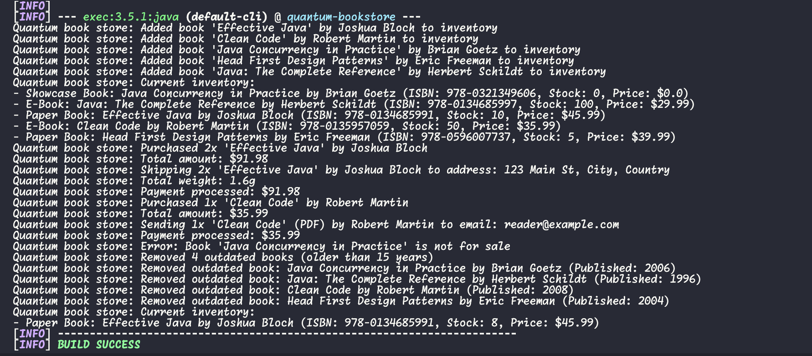

# Quantum Bookstore for Fawry Challenge

## How to Run

Make sure you have Java 8+ and Maven installed.

```bash
mvn clean compile exec:java -Dexec.mainClass="com.fawrychallenge.App"
```

## Example Output



## Project Structure

```
src/main/java/com/fawrychallenge/
├── App.java - Main application entry point
└── bookstore/
    ├── books/
    │   ├── core/
    │   │   ├── Book.java - Base book class
    │   │   ├── Shippable.java - Interface for shippable books
    │   │   └── Emailable.java - Interface for emailable books
    │   ├── PaperBook.java - Physical books that can be shipped
    │   ├── EBook.java - Digital books that can be emailed
    │   └── ShowcaseBook.java - Demo books (not for sale)
    ├── inventory/
    │   └── BookInventory.java - Book inventory management
    └── services/
        ├── ShippingService.java - Shipping service for paper books
        └── MailService.java - Email service for e-books
```

## Features

- **Multiple Book Types:**

  - Paper Books: Physical books that can be shipped with weight tracking
  - E-Books: Digital books that can be emailed with file type support
  - Showcase Books: Demo books that are not for sale

- **Inventory Management:**

  - Add books with ISBN, title, author, year, price
  - Remove outdated books based on publication year
  - Track stock quantities with automatic validation

- **Purchase System:**
  - Buy books with quantity validation
  - Automatic shipping for paper books
  - Automatic email delivery for e-books
  - Error handling for invalid purchases

## Extensibility

The system is designed to be easily extensible:

- New book types can be added by extending the `Book` class
- New behaviors can be added through interfaces
- New services can be added without modifying existing code
- The inventory system automatically handles new book types
